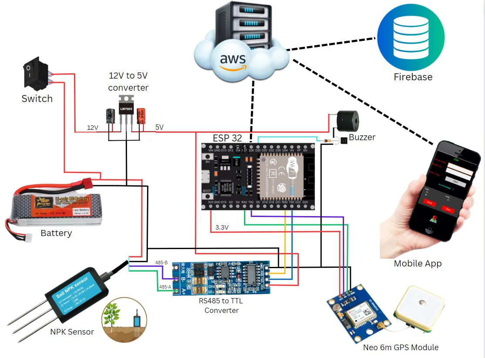
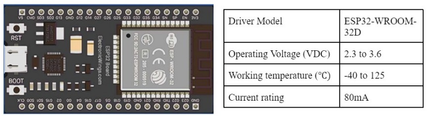
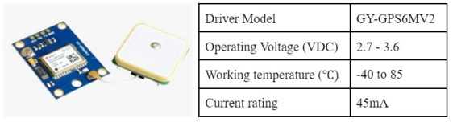
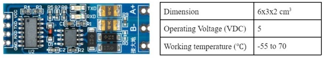
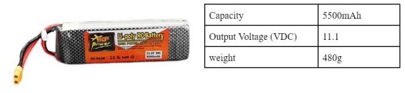
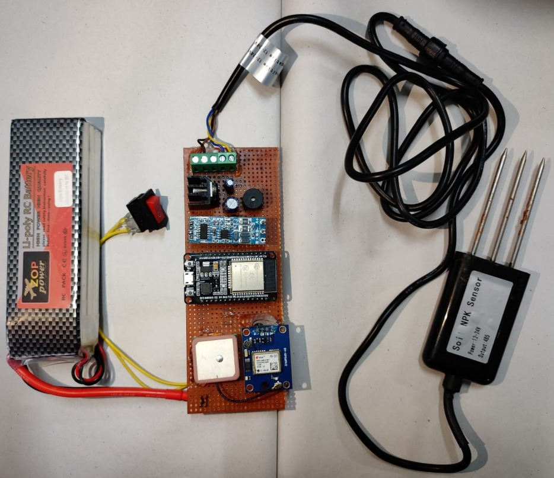
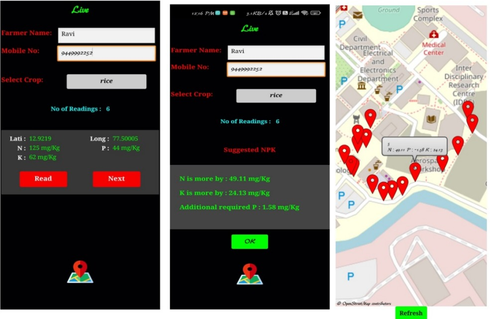

# Development of Real-Time Crop Cultivation and Nutrient Recommendation System (SmartAgro)

SmartAgro is an innovative project that addresses the challenges faced by farmers in optimizing crop choices and nutrient management. The project aims to revolutionize traditional agricultural practices by providing real-time, data-driven insights into soil characteristics.

## Table of Contents

- [Introduction](#introduction)
- [Literature Review](#literature-review)
- [Brief Methodology](#brief-methodology)
- [DESIGN AND ARCHITECTURE OF THE DEVICE](#design-and-architecture-of-the-device)
- [Specifications for the Design](#specifications-for-the-design)
- [Pre-analysis work](#pre-analysis-work)
- [IMPLEMENTATION](#implementation)
  - [Firebase](#firebase)
  - [AWS EC2](#aws-ec2)
  - [MIT App Inventor](#mit-app-inventor)
- [Integrated System Overview](#integrated-system-overview)
- [Conclusion](#conclusion)
- [License](#license)

## Introduction

Our county's economic growth hinges on agriculture, employing over half of India's population and contributing significantly to global GDP. To combat challenges in the agricultural sector, we introduce SmartAgro, a project focused on enhancing productivity and sustainability through innovative technology.

Factors such as nutrient content, irrigation, soil type, and fertilizer use significantly impact crop production. Soil characteristics, particularly Nitrogen (N), Phosphorus (P), and Potassium (K) levels, play a crucial role in maintaining fertility. However, inappropriate fertilizer use leads to nutrient imbalances, affecting crop yield and increasing production costs.

SmartAgro proposes a data-driven approach, leveraging Artificial Intelligence and Machine Learning (AIML) to provide accurate, timely, and personalized recommendations for optimizing crop cultivation practices and nutrient management. This integration addresses challenges faced by farmers, offering solutions from cultivation to waste management.

The project employs Machine Learning models (LR, PR, ER, RFR, SVR, DNN) to predict crop yields, considering chemical indicators and biological markers. SmartAgro aims to generate personalized nutrient recommendations, allowing farmers to optimize fertilizer use, minimize environmental impact, and enhance overall crop productivity.

SmartAgro is a commitment to ushering in a new era of precision agriculture and sustainable farming practices, aligning with technological advancements to benefit farmers and secure a prosperous future for agriculture.

## Literature Review

The agricultural industry's pivotal role in economic growth, employing over half of India's population and contributing significantly to global GDP, underscores the need for innovative solutions to enhance productivity and profitability. The integration of technology into agriculture has become crucial, focusing on providing farmers with timely and accurate data based on soil type and climatic parameters.

To refine data categorization, fuzzy logic, in conjunction with rough sets, is employed to handle numerical feature boundary values, enhancing prediction accuracy by considering soil micro and macro-nutrients. Key factors influencing crop yield, such as identifying crop illnesses, suggesting suitable crops for specific lands, and recommending appropriate fertilizers, are addressed using advanced technologies.

The study utilizes the Extensive Gradient Boosting (XGBoost) model for crop prediction, Random Forest for fertilizer recommendation, and MobileNet for disease detection based on local soil nutrients, including N, P, K, and pH values, and rainfall . The XGBoost algorithm achieves a 99% accuracy for crop prediction, Random Forest attains 95.7% for fertilizer recommendation, and MobileNet achieves 92% accuracy for disease detection.

Remote sensing techniques, including Radio Detection and Ranging (RADAR) and Light Detection and Ranging (LiDAR), are explored for their potential to predict crop yield. Various parameters derived from multi-sensor data are employed to evaluate biophysical and biochemical characteristics related to crops. Synthetic datasets from biophysical crop models, such as OilcropSun and Ceres-Wheat from the Decision-Support System for Agro-technology Transfer (DSSAT), are used to assess predictive algorithms' impact on performance.

The Multimodal Machine Learning Based Crop Recommendation and Yield Prediction (MMML-CRYP) approach focuses on effective crop recommendation using equilibrium optimizer (EO) with kernel extreme learning machine (KELM) and accurate crop production prediction using the random forest (RF) technique. The MMML-CRYP technique outperforms other approaches with a maximum accuracy of 97.91%.

In summary, the reviewed literature underscores the significance of machine learning algorithms, remote sensing techniques, and computational intelligence in predicting crop yield and optimizing nutrient recommendations. However, limitations of lab-based tests and a lack of research on soil nutrient enhancement and crop suitability in specific regions pose challenges for farmers. Addressing these gaps is essential to empower farmers with valuable insights for sustainable agricultural practices and enhanced productivity.

## Brief Methodology

### Sensor Integration:
The user inserts the Nitrogen-Phosphorus-Potassium (NPK) sensor into the soil.
The NPK sensors are designed to collect soil nutrient values.

### Data Transmission:
The collected data from the NPK sensors is transmitted to a cloud database using a microcontroller.

### Architecture Overview:
The project employs an architecture where NPK sensors communicate with a microcontroller, which, in turn, transmits data to a cloud database. Figure 1.1 provides an overview of this architecture.

### Mobile Application:
Users interact with the system through a mobile application.
The application allows users to select a specific crop from a dropdown menu.

### AWS Integration:
The selected crop information is sent to an Amazon Web Services (AWS) server for processing.
AWS processes the data and returns additional NPK requirements for the selected crop to the mobile application.

### Fallback Mechanism:
If the crop name is not specified, the server predicts the crop and provides probabilities, enhancing user flexibility.

### Connectivity and Efficiency:
The proposed design ensures seamless connectivity between sensors, microcontroller, cloud databases, and the mobile application.
This integrated approach offers a robust and efficient solution to support sustainable and productive farming practices.

## DESIGN AND ARCHITECTURE OF THE DEVICE
The system is designed to enhance agricultural productivity and sustainability by providing accurate crop suitability predictions and precise nutrient recommendations based on sensor data. A user-friendly mobile application is developed which allows farmers to interact with the system, select crops, and receive real-time nutrient recommendations. The portable device is built in order to ease the process of soil testing. The current chapter will delve into the discussion of the envisioned intricate design structure of the Crop Cultivation and Nutrient Recommendation System (CCNRS).

## Specifications for the Design

The CCNRS consists of multiple hardware components which are connected to each other. During the design of CCNRS as shown in figure 3.1 , all the specifications of individual parts are taken into consideration to see whether the requirements are fulfilled and the objectives are achieved. Since the components are connected to each other, they must also be verified if they are compatible with each other. The interfacing type should be the same and voltage and current levels must be below the threshold.

### Soil NPK sensor

The Soil NPK Sensor is utilized to fetch the Nitrogen (N), Phosphorus (P), and Potassium (K) values from the soil. It provides an output signal in RS485 format. The measurement range spans from 0 to 1999 mg/kg.

### ESP32 Wi-Fi and Bluetooth MCU

It is a series of low-cost, low-power systems on a-chip microcontroller with integrated Wi-Fi and dual-mode Bluetooth. The sensor data is sent to the Firebase database using ESP32. The GPS module is also attached to the controller for to provide the location details.

### NEO-6M GPS Chip

The NEO-6M GPS Chip is employed to determine the precise location of the test sample collected. Subsequently, this location information is utilized to display the position on the map within mobile application.

### MAX485 TTL To RS485

This module facilitates the conversion of the TTL interface from the microcontroller to the RS485 module. The NPK Sensor’s data is in RS485 format.

### Li-poly RC Battery

The Li-poly RC Battery serves as the power source for the entire system, including the controller board.

## Pre-analysis work 
- Requirement Gathering: 
    Identify and gather the specific requirements of the project, including the functionalities of the real-time crop prediction and nutrient recommendation system, the data needed from NPK sensors, and the desired output for farmers.
- Data Collection: 
    Determine the types of data required for the ML model, such as historical crop yield data, soil data, and NPK sensor data. Explore available datasets and sources for data collection.
- ML Model Selection: 
    Evaluate different ML algorithms suitable for crop prediction and nutrient recommendation tasks, considering factors like accuracy, computational complexity, and interoperability.
- Design of Mobile Application: 
    Plan the user interface and functionalities of the mobile application for farmers to interact with the system, including crop selection, sensor data visualization, and nutrient recommendations.
- Battery Specifications: 
    The battery to be used in CCNRS should continuously provide power supply to the sensors, controller. The NPK sensor output needs to be converted to less than 5V to be compatible with the ESP32.

## IMPLEMENTATION 

Focuses on the integration and utilization of hardware and software components in the real-time CCNRS. It combines NPK sensors and ESP32 microcontroller to collect and transmit soil nutrient data, while the NEO-6M GPS chip captures geographical locations. The cloud database, Firebase, securely stores real-time sensor data, and the AWS Elastic Compute Cloud (AWS EC2) server deploys the ML model for crop prediction. The mobile application ’E-Dharani’ created using MIT App Inventor, provides farmers with intuitive access to soil health data, crop predictions, and nutrient recommendations. The seamless collaboration of these elements empowers farmers to make data-driven decisions, optimize resources, and embrace sustainable farming practices.

## Firebase

The Crop Cultivation and Nutrient Recommendation System (CCNRS) optimizes real-time data management through the integration of Firebase as its cloud database. Firebase provides scalability, security, and seamless synchronization, allowing the microcontroller to transmit sensor data efficiently. The structured storage format includes farmer details, NPK values, location, and timestamps. Processed outputs, such as additional NPK and crop predictions, are stored separately. Firebase's real-time nature ensures instant access to data, empowering farmers with prompt recommendations through the mobile application. With secure authentication features, Firebase enhances data privacy and access control, contributing to the system's usability and effectiveness for informed decision-making in agriculture.

## AWS EC2

The Crop Cultivation and Nutrient Recommendation System (CCNRS) leverages AWS EC2 as its cloud computing infrastructure for hosting and deploying the machine learning (ML) model. With scalable computing resources, the EC2 server efficiently manages incoming sensor data requests, configured with ample computational power and memory to run ML algorithms effectively.

The trained ML model is deployed on the EC2 instance, allowing real-time processing of sensor data received from Firebase. The EC2 server predicts suitable crops based on NPK sensor values and calculates precise nutrient recommendations for optimal growth. Its scalability ensures simultaneous handling of multiple sensor data streams, enabling real-time predictions across numerous farming locations.

The AWS EC2 server, with robust and scalable computing resources, seamlessly integrates with Firebase, facilitating smooth data flow for timely and accurate crop predictions and nutrient recommendations. Once processed, the ML model outputs are sent back to Firebase for accessibility by the mobile application and other stakeholders. This utilization not only ensures the availability and reliability of the ML model but also provides a cost-effective and scalable solution for the computational demands of real-time agriculture applications.

## MIT App Inventor
MIT App Inventor serves as the development tool for the mobile application in the real-time crop prediction and nutrient recommendation system. This user-friendly visual programming platform eliminates the need for traditional coding, enabling the creation of Android applications. MIT App Inventor was instrumental in designing the mobile app's user interface and functionality, providing farmers with easy access to real-time data visualizations, crop predictions, and nutrient recommendations.

The mobile application, named 'E-Dharani,' integrates seamlessly with the cloud server to retrieve sensor data, display crop suitability based on the ML model's output, and deliver accurate nutrient recommendations to farmers. The intuitive development environment of MIT App Inventor facilitated rapid app creation, ensuring accessibility and ease of use for farmers.

##  Integrated System Overview

The project achieves a seamless integration of various software and hardware components to establish a comprehensive real-time crop prediction and nutrient recommendation system. The collaborative efforts of NPK sensors, ESP32 microcontroller, cloud server on AWS, and the mobile application developed with MIT App Inventor contribute to the system's efficiency and functionality.

### Hardware Components:

#### NPK Sensor and ESP32 Microcontroller:
- NPK sensor measures Nitrogen, Phosphorus, and Potassium levels in the soil.
- ESP32 microcontroller facilitates communication between the sensor and the cloud server.

### Software Components:

#### Cloud Server on AWS:
- Receives and processes sensor data using ML algorithms for crop suitability predictions and nutrient requirements.

#### Mobile Application (MIT App Inventor):
- User-friendly interface for farmers to interact with the cloud server.
- Enables input of crop preferences and provides instant feedback on suitable crops and precise nutrient recommendations.

### Integration Process:

#### Data Flow from Hardware to Cloud:
- NPK sensor and ESP32 collaboratively collect and transmit soil nutrient data to the AWS cloud server.

#### ML Algorithm Processing:
- The cloud server processes sensor data using ML algorithms, such as Naive Bayes, to predict crop suitability and nutrient requirements.

#### Mobile Application Interface:
- MIT App Inventor-developed mobile app serves as a user-friendly interface for farmers.
- Allows input of crop preferences and retrieves real-time data, including crop predictions and nutrient recommendations.

#### Real-time Information Access:
- Farmers gain access to real-time soil health information and receive accurate crop recommendations on their mobile devices through the app.

#### Informed Decision-Making:
- The integrated system empowers farmers to make informed decisions, optimizing fertilizer application and ensuring optimal crop growth.

#### Data-Driven Precision Farming:
- Collaboration between hardware and software components enables precision farming techniques, leading to increased crop yield, resource efficiency, and sustainable agricultural practices.

#### Enhanced Productivity and Sustainability:
- Reliable and effective integration ensures that farmers can optimize crop productivity, make data-driven decisions, and adopt environmentally responsible farming practices.

## Conclusion
The Crop Cultivation and Nutrient Recommendation System (CCNRS) leverages ML and IoT technologies to revolutionize modern agriculture. By integrating NPK sensors, microcontrollers, cloud databases, and ML algorithms, the system empowers farmers with real-time soil health insights and crop recommendations. The portable and user-friendly solution allows for seamless deployment in agricultural fields.

Hardware components like NPK sensors and ESP32 microcontrollers efficiently collect and transmit data to the cloud server, where ML algorithms generate accurate crop predictions and nutrient recommendations. The MIT App Inventor-developed mobile application serves as a convenient interface, enabling farmers to make informed decisions based on real-time soil health data.

The CCNRS offers tangible benefits, including increased crop yield, reduced resource wastage, and enhanced sustainability. Precision farming techniques, guided by real-time data, allow farmers to optimize inputs, leading to cost savings and environmental conservation. Timely crop recommendations enable adaptive cultivation practices, mitigating risks and maximizing agricultural productivity. In essence, the project paves the way for a more efficient and resilient farming ecosystem, showcasing the potential of technology in advancing smart agriculture.

## License
This project is licensed under the [MIT License](https://opensource.org/licenses/MIT) - see the [LICENSE](LICENSE) file for details.
