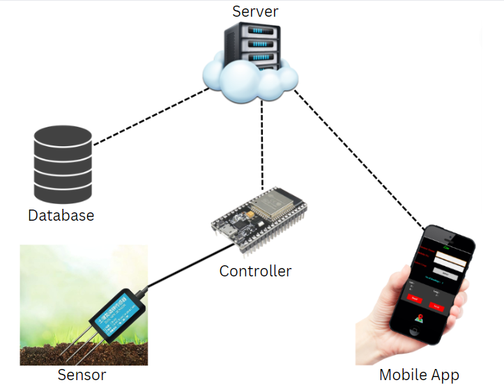
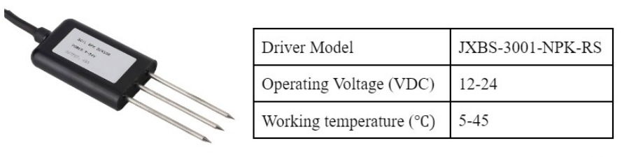

# Development of Real-Time Crop Cultivation and Nutrient Recommendation System (SmartAgro)

SmartAgro is an innovative project that addresses the challenges faced by farmers in optimizing crop choices and nutrient management. The project aims to revolutionize traditional agricultural practices by providing real-time, data-driven insights into soil characteristics.

## Table of Contents

- [Introduction](#introduction)
- [Features](#features)
- [Hardware Requirements](#hardware-requirements)
- [Software Requirements](#software-requirements)
- [Installation](#installation)
- [Usage](#usage)
- [Folder Structure](#folder-structure)
- [Contributing](#contributing)
- [License](#license)

## Introduction

Our county's economic growth hinges on agriculture, employing over half of India's population and contributing significantly to global GDP. To combat challenges in the agricultural sector, we introduce SmartAgro, a project focused on enhancing productivity and sustainability through innovative technology.

Factors such as nutrient content, irrigation, soil type, and fertilizer use significantly impact crop production. Soil characteristics, particularly Nitrogen (N), Phosphorus (P), and Potassium (K) levels, play a crucial role in maintaining fertility. However, inappropriate fertilizer use leads to nutrient imbalances, affecting crop yield and increasing production costs.

SmartAgro proposes a data-driven approach, leveraging Artificial Intelligence and Machine Learning (AIML) to provide accurate, timely, and personalized recommendations for optimizing crop cultivation practices and nutrient management. This integration addresses challenges faced by farmers, offering solutions from cultivation to waste management.

The project employs Machine Learning models (LR, PR, ER, RFR, SVR, DNN) to predict crop yields, considering chemical indicators and biological markers. SmartAgro aims to generate personalized nutrient recommendations, allowing farmers to optimize fertilizer use, minimize environmental impact, and enhance overall crop productivity.

SmartAgro is a commitment to ushering in a new era of precision agriculture and sustainable farming practices, aligning with technological advancements to benefit farmers and secure a prosperous future for agriculture.

## Literature Review

The agricultural industry's pivotal role in economic growth, employing over half of India's population and contributing significantly to global GDP, underscores the need for innovative solutions to enhance productivity and profitability. The integration of technology into agriculture has become crucial, focusing on providing farmers with timely and accurate data based on soil type and climatic parameters.

To refine data categorization, fuzzy logic, in conjunction with rough sets, is employed to handle numerical feature boundary values, enhancing prediction accuracy by considering soil micro and macro-nutrients. Key factors influencing crop yield, such as identifying crop illnesses, suggesting suitable crops for specific lands, and recommending appropriate fertilizers, are addressed using advanced technologies.

The study utilizes the Extensive Gradient Boosting (XGBoost) model for crop prediction, Random Forest for fertilizer recommendation, and MobileNet for disease detection based on local soil nutrients, including N, P, K, and pH values, and rainfall . The XGBoost algorithm achieves a 99% accuracy for crop prediction, Random Forest attains 95.7% for fertilizer recommendation, and MobileNet achieves 92% accuracy for disease detection.

Remote sensing techniques, including Radio Detection and Ranging (RADAR) and Light Detection and Ranging (LiDAR), are explored for their potential to predict crop yield. Various parameters derived from multi-sensor data are employed to evaluate biophysical and biochemical characteristics related to crops. Synthetic datasets from biophysical crop models, such as OilcropSun and Ceres-Wheat from the Decision-Support System for Agro-technology Transfer (DSSAT), are used to assess predictive algorithms' impact on performance.

The Multimodal Machine Learning Based Crop Recommendation and Yield Prediction (MMML-CRYP) approach focuses on effective crop recommendation using equilibrium optimizer (EO) with kernel extreme learning machine (KELM) and accurate crop production prediction using the random forest (RF) technique. The MMML-CRYP technique outperforms other approaches with a maximum accuracy of 97.91%.

In summary, the reviewed literature underscores the significance of machine learning algorithms, remote sensing techniques, and computational intelligence in predicting crop yield and optimizing nutrient recommendations. However, limitations of lab-based tests and a lack of research on soil nutrient enhancement and crop suitability in specific regions pose challenges for farmers. Addressing these gaps is essential to empower farmers with valuable insights for sustainable agricultural practices and enhanced productivity.

## Brief Methodology of the project

### Sensor Integration:
The user inserts the Nitrogen-Phosphorus-Potassium (NPK) sensor into the soil.
The NPK sensors are designed to collect soil nutrient values.

### Data Transmission:
The collected data from the NPK sensors is transmitted to a cloud database using a microcontroller.

### Architecture Overview:
The project employs an architecture where NPK sensors communicate with a microcontroller, which, in turn, transmits data to a cloud database. Figure 1.1 provides an overview of this architecture.

### Mobile Application:
Users interact with the system through a mobile application.
The application allows users to select a specific crop from a dropdown menu.

### AWS Integration:
The selected crop information is sent to an Amazon Web Services (AWS) server for processing.
AWS processes the data and returns additional NPK requirements for the selected crop to the mobile application.

### Fallback Mechanism:
If the crop name is not specified, the server predicts the crop and provides probabilities, enhancing user flexibility.

### Connectivity and Efficiency:
The proposed design ensures seamless connectivity between sensors, microcontroller, cloud databases, and the mobile application.
This integrated approach offers a robust and efficient solution to support sustainable and productive farming practices.

## DESIGN AND ARCHITECTURE OF THE DEVICE
The system is designed to enhance agricultural productivity and sustainability by providing accurate crop suitability predictions and precise nutrient recommendations based on sensor data. A user-friendly mobile application is developed which allows farmers to interact with the system, select crops, and receive real-time nutrient recommendations. The portable device is built in order to ease the process of soil testing. The current chapter will delve into the discussion of the envisioned intricate design structure of the Crop Cultivation and Nutrient Recommendation System (CCNRS).

## Specifications for the Design

The CCNRS consists of multiple hardware components which are connected to each other. During the design of CCNRS as shown in figure 3.1 , all the specifications of individual parts are taken into consideration to see whether the requirements are fulfilled and the objectives are achieved. Since the components are connected to each other, they must also be verified if they are compatible with each other. The interfacing type should be the same and voltage and current levels must be below the threshold.

### Soil NPK sensor

